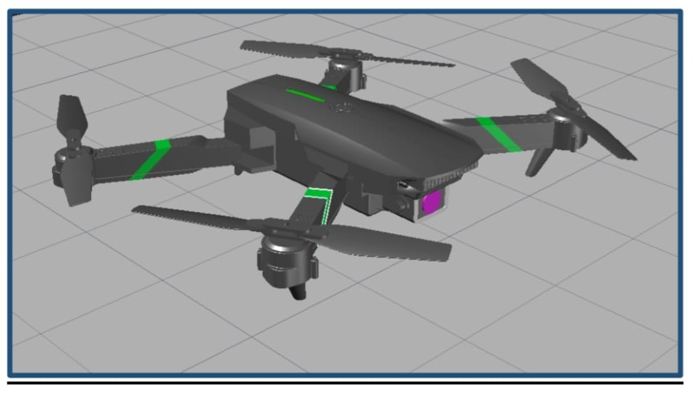
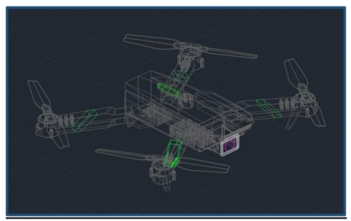
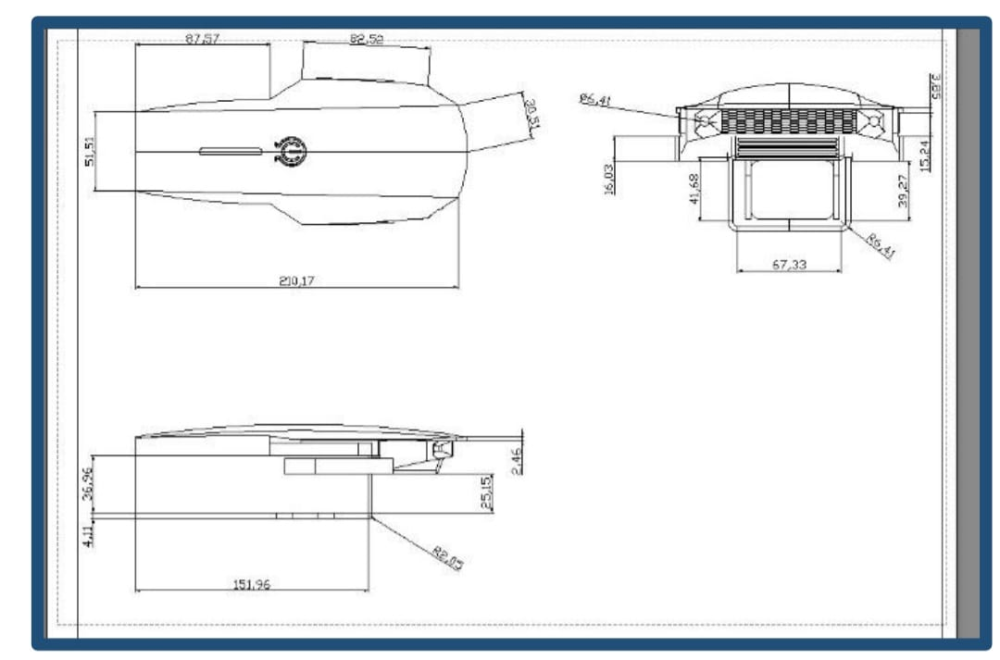
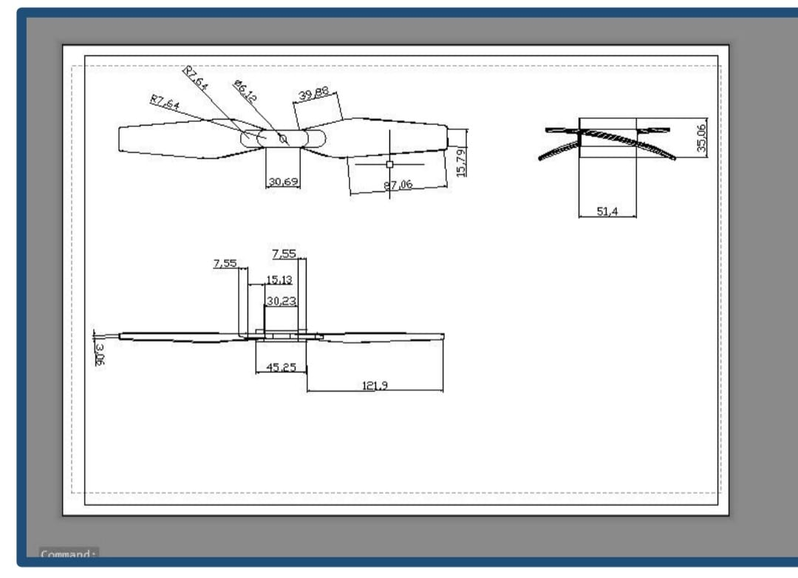
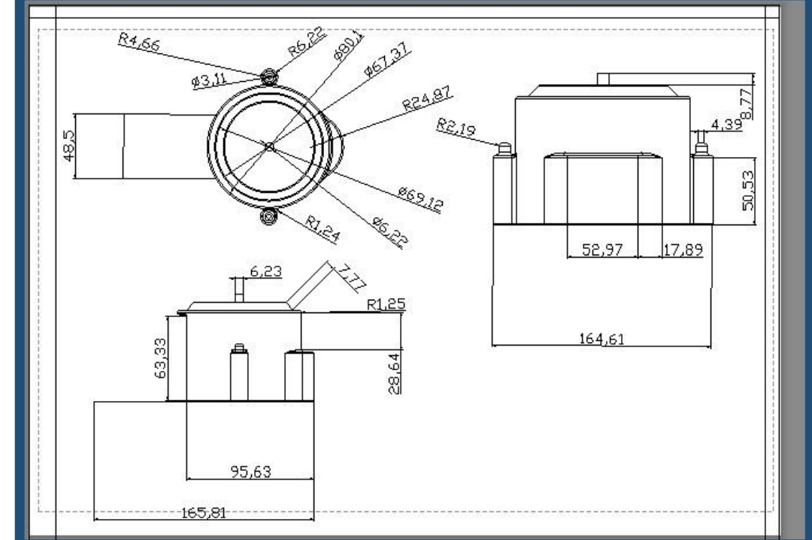
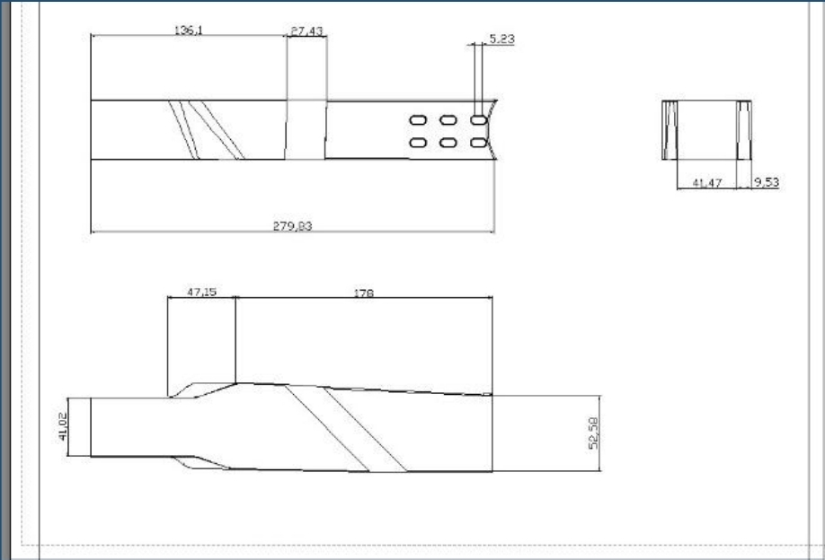
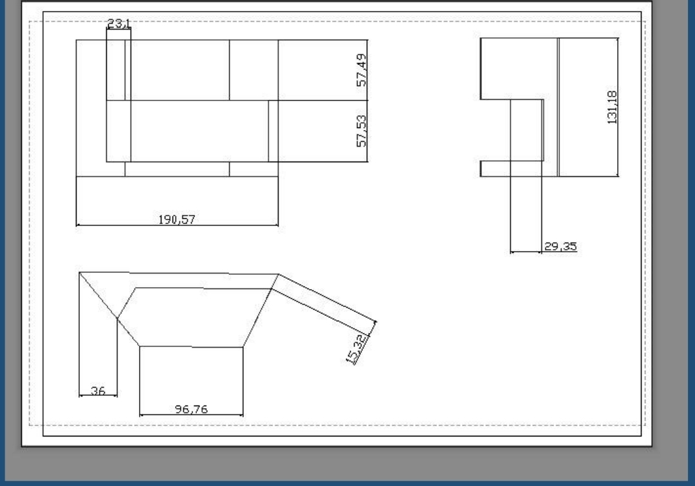

# Quadcopter Drone — AutoCAD 2D & 3D Model

A fully modelled quadcopter drone designed in AutoCAD, covering every component from
individual part drawings to complete final assembly. Includes 1st angle projections,
dimensioned 2D technical drawings, and 3D rendered models for all 5 parts.

---

## Final Assembly

---

## Project Overview

This project focuses on the complete 2D and 3D modelling of a quadcopter UAV in AutoCAD.
Each part was first drafted in 2D with full dimensions, then modelled in 3D using
AutoCAD solid modelling commands, and finally assembled into a complete drone model.

---

## Parts Modelled

| # | Part | AutoCAD Commands Used |
|---|------|-----------------------|
| 1 | Mainframe | Loft, Extrude, Presspull, Move, Subtract, Slice |
| 2 | Propeller Blade | Arc, Fillet, Extrude, Trim |
| 3 | Propeller Mount | Extrude, Presspull, Fillet, Loft, Subtract, Intersect |
| 4 | Propeller Arm | Extrude, Subtract, Loft |
| 5 | Arm Mount | Rectangle, Extrude |

---

## Part Drawings

### 1. Mainframe

The body was split into three sub-parts (upper curved section, lower body, middle section),
modelled separately and aligned using the Move command.

### 2. Propeller

Blade shape created using Arc and Fillet commands, extruded to thickness.
Middle joint made from rectangles and circles.

### 3. Propeller Mount

Most complex part — required combining Loft, Subtract, Fillet, Extrude, and Intersect
commands. Circular and rectangular sections built separately then joined.

### 4. Propeller Arm

Extruded from 2D rectangular profiles, shaped with Subtract and Loft commands.

### 5. Arm Mount

Connects propeller arm to mainframe. Built from simple rectangular extrusions.

---

## How to Open

1. Open AutoCAD (2020 or later recommended)
2. File → Open → select `quadcopter_drone.dwg`
3. Use the Layer Manager to toggle between individual parts and full assembly view

## Working Principle

A quadcopter generates lift using four propellers. Each propeller pushes air downward,
producing an equal and opposite upward thrust. Height and direction are controlled by
varying the speed of individual propellers — no mechanical steering required.

## Applications

Quadcopters are used across rescue operations, agriculture (crop spraying), surveillance,
photography, and delivery — with modular payload attachment beneath the frame.

---

## What I Learned

- Translating physical mechanical systems into precise 2D engineering drawings
- Building complex 3D geometry using solid modelling commands (Loft, Subtract, Intersect)
- Managing multi-part assemblies with proper component alignment in AutoCAD
- Applying 1st angle projection standards for technical documentation

---

## Tools Used

- AutoCAD (2D drafting + 3D solid modelling)
- 1st Angle Projection standard

---

## Author

**Mirza Uzair Mehmood Baig**
Mechatronics Engineering, NUST CEME '26
[LinkedIn](https://www.linkedin.com/in/mirza-uzair-mehmood-baig-913b25383/) · [GitHub](https://github.com/Uzair458)

